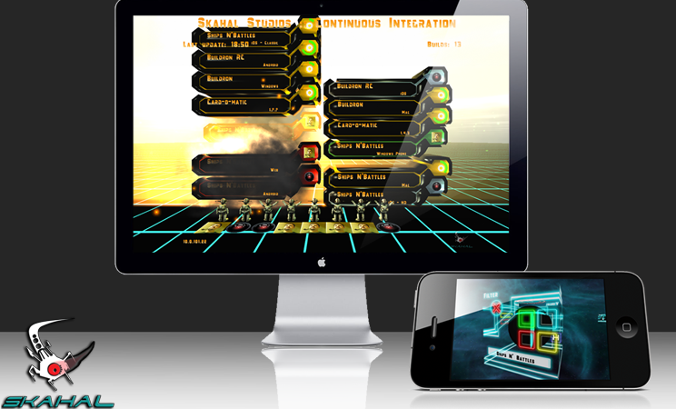
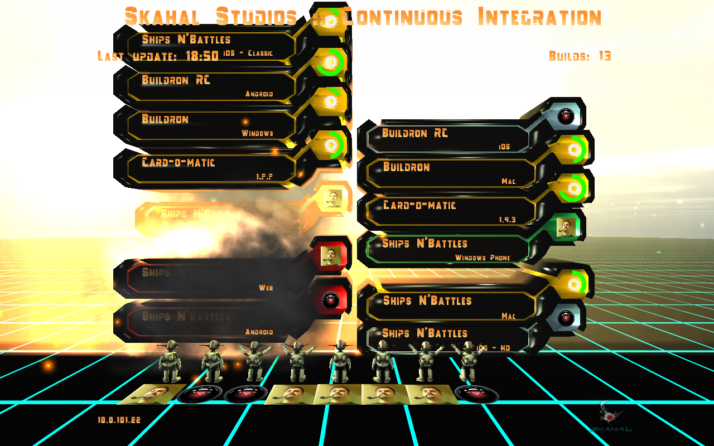

# Buildron

## Your builds, our world!

### What is this?

Buildron is an free and open source app from developers to developers. Are you a developer? No, so take a look on our game [Ships N' Battles](https://itunes.apple.com/br/app/ships-n-battles-hd/id510480132?mt=8), you will enjoy it a much more than Buildron.

Well, are you still here? Oh... maybe you are a developer, or a geek... maybe both!

Buildron is what people like to call as a radiator, a Continous Integration Radiator or a Build Radiator, but we took a more immersive approach than the traditional Continous Integration Radiators on the way.

## What people are saying about it?

> "All I can say - this is awesome! Thank you for bringing a good entertainment to such a boring area as continuous integration!"
> Pavel Sher, TeamCity team.

## Why use it?
As Martin Fowler said about CI:

> "Everyone can see what's happening
> Continuous Integration is all about communication, so you want to ensure that everyone can easily see the state of the system and the changes that have been made to it. One of the most important things to communicate is the state of the mainline build. ...Many teams like to make this even more apparent by hooking up a continuous display to the build system - lights that glow green when the build works, or red if it fails are popular."

Be sure that the whole team knowns the state of your builds is very important part o Continous Integration.

## How It Looks Like?
Nowadays we have a lot of options of Continous Integrations Servers, like TeamCity, CruiseControl and Jenkins. All this amazing servers have a page that display the state of your builds, but .... we must be honest … it's so simple!

We wanna something more interactive, more visual and, what not, more FUN!

See it in action: [https://www.youtube.com/watch?v=sEghUYUvTHg](https://www.youtube.com/watch?v=sEghUYUvTHg)

Buildron is a 3D environment where each of your build configuration became a Totem. Each Totem display some information of the build, like project name and configuration, last user that has triggered the build, and, of course, the state of build: success, running, failed and queued.

Each user on the IC Server will became a 3D avatar on the environment, a little robot that raise the arms when the build go success or put hans on head when the build failed. Buildron uses Gravatar, so you can put your photo close to the avatar (the e-mail used on CI Server will be used).

## Which CI Servers are Supported?
The current version supports Hudson, Jenkins and TeamCity, but we have developed using good design patterns, like Abstract Factory and so on. We just need to implement news factories for the others CI Servers. So, what will be next server supported by Buildron? You can fork it, implement the IBuildsProvider interface and became part of the family ;) 

## How can I Interact with it?
Would you like to interact with Buildron? Take a look on [Buildron RC](http://github.com/skahal/buildron-rc).

### Buildron RC 
Buildron RC is a 3D remote control app for Buildron where you can: 
	
	✓ Filter the builds by status or build name 
	✓ Start or stop a build 
	✓ Sort builds by name and status 
	✓ Zoom in and zoom out 
	✓ Get closer to the builds history totem 
	✓ Share Buildron screenshots on Twitter 

It's fun, you should try.

Oh, we need to warm you: there is some easter eggs to be found here... Free your mind ;)

## I Like the idea, what's next?
Well, since Buildron is free and open source, why don’t give it a shoot? Download and put it to run, your team will see the Continous Integration with a different way.

And if you really like it, and want to support it, you can starred or fork it.

Help us to popularize Buidlron, spread the word in the social networks, blogs, friends, etc.

Please, follow Skahal Studios on [Twitter](http://twitter.com/skahal) and Facebook.

If you like taking a picture from your TV or monitor running Buildron: send to us! We will appreciate to see this and put your Buildron picture on our ["Buildron around the World gallery"](docs/images/around-the-world-gallery). 

## Setup
Download the latest version from our [releases page](https://github.com/skahal/Buildron/releases), unzip it anywhere in the machine where you want to run Buildron.

## Usage
### Run
Just execute it:

- On Windows: Buildron.exe 
- On Mac (OSX): Buildron.app ([move it to Applications folder](https://github.com/skahal/Buildron/wiki/faq#why-i-see-0-mods-running-buildron-on-mac))

### Auto start
If you want to run Buildron and auto start/connect to CI server, just pass the autostart argument to it:

- On Windows: Buildron.exe autostart
- On Mac (OSX): open Buildron.app --args autostart

## Mods
Buildron support mods, in fact about everything you see or listen in Buildron is a mod. 

Read more about how to build your own Buidlron's mod in our [wiki](https://github.com/skahal/buildron/wiki).

## FAQ

Having troubles? 

- Read our [wiki](https://github.com/skahal/buildron/wiki).
- Ask on Twitter [@skahal](http://twitter.com/skahal).

## How to improve it?

Create a fork of [Buildron](https://github.com/skahal/buildron/fork). 

Did you change it? [Submit a pull request](https://github.com/skahal/buildron/pull/new/master).

## License
Licensed under the The MIT License (MIT).
In others words, you can use this library for developement any kind of software: open source, commercial, proprietary and alien.
